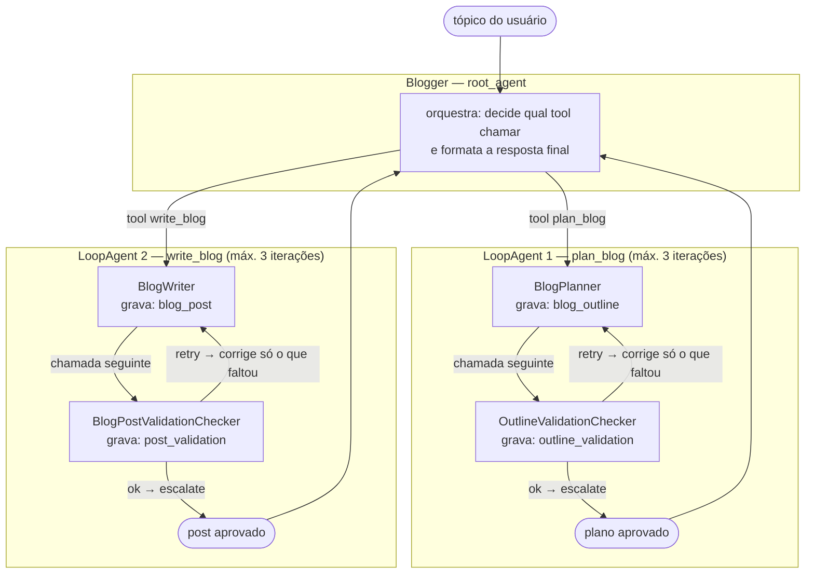

# Blogger — agente multi-agente com Google ADK

Agente que transforma um tópico em post de blog técnico. Ele **planeja** um
outline, **escreve** o artigo, e um **validador** observa o resultado e manda
refazer o que estiver faltando antes de entregar.

Baseado no tutorial
[Build an AI Agent with Google ADK](https://github.com/smithakolan/awesome-ai-agents/tree/main/build-ai-agent-google-adk)
do `smithakolan/awesome-ai-agents`, com correções que o exemplo original
precisa para funcionar de verdade (ver [Diferenças em relação ao original](#diferenças-em-relação-ao-original)).

---

## Como funciona

<picture>
  <source media="(prefers-color-scheme: dark)" srcset="docs/fluxo-escuro.svg">
  
</picture>

<details>
<summary>Ver o código Mermaid do diagrama (ou editar)</summary>



</details>

<details>
<summary>Se você preferir ler como lista</summary>

1. O usuário manda um tópico; o `Blogger` (root) recebe e decide por qual
   tool começar.
2. `tool plan_blog` entra no **LoopAgent 1**:
   - `BlogPlanner` escreve `blog_outline` no state;
   - `OutlineValidationChecker` escreve `outline_validation`;
   - veredito `ok` → `escalate` encerra o loop; `retry` → o planner
     refaz o outline lendo o veredito anterior.
3. O root recebe o plano aprovado e chama `tool write_blog`:
   - `BlogWriter` escreve `blog_post`;
   - `BlogPostValidationChecker` escreve `post_validation`;
   - mesma regra de `ok`/`retry`, com `max_iterations=3` nos dois loops.
4. Com o post aprovado, o root formata a resposta final.

Os dois validadores são o coração do desenho. Cada um vive dentro de um
`LoopAgent` com o seu gerador, roda até 3 vezes, e **para assim que o
veredito é `ok`** (o `after_agent_callback` `escalate_when_approved` levanta a
flag `escalate` e o loop encerra na hora). Se o veredito for `retry`, o
gerador recebe o veredito da iteração anterior e corrige só o que faltou —
não recomeça do zero.

</details>

### Onde os dados ficam

O tópico **não** passa pelo state: o `root_agent` o repassa no argumento
`request` de cada `AgentTool`, e ele chega ao sub-agente como mensagem de
usuário. O que passa pelo state são os artefatos intermediários:

| Chave do state | Escreve | Lê |
|---|---|---|
| `blog_outline` | `BlogPlanner` | `BlogWriter`, os 2 validadores |
| `outline_validation` | `OutlineValidationChecker` | `BlogPlanner` (iteração anterior) |
| `blog_post` | `BlogWriter` | `BlogPostValidationChecker` |
| `post_validation` | `BlogPostValidationChecker` | `BlogWriter` (iteração anterior) |

> **Detalhe que costuma morder:** citar o nome da chave no prompt não faz
> nada. O LLM só enxerga o valor de uma chave do state se ela for
> interpolada com `{chave}` no `instruction`. O `?` — como em
> `{blog_outline?}` — torna a interpolação opcional, para não estourar
> `KeyError` na primeira iteração, quando a chave ainda não existe.

---

## Requisitos

- Python 3.10+ (testado no 3.12.3)
- Uma API key do [Google AI Studio](https://aistudio.google.com/apikey)

---

## Instalação

```bash
# 1. ambiente virtual
python3 -m venv .venv
source .venv/bin/activate        # Windows: .venv\Scripts\activate

# 2. dependências
pip install -r requirements.txt

# 3. chave da API
cp .env.example .env
# edite o .env e cole sua chave:
#     GOOGLE_API_KEY=AQ.sua_chave_aqui
#     MODEL=gemini-3.1-flash-lite
```

A chave também pode vir do shell, sem `.env`:

```bash
export GOOGLE_API_KEY="AQ.sua_chave_aqui"
```

Para torná-la permanente, coloque essa linha no seu `~/.zshrc` (ou
`~/.bashrc`).

---

## Como rodar

O ADK 2.9.2 espera a **pasta** do agente, nunca o arquivo `agent.py`. Como
cada agente mora na sua própria subpasta:

```bash
# Interface web de debug (a melhor opção para inspecionar o state)
adk web .
# abre em http://127.0.0.1:8000

# Uma execução, com o tópico no argumento
adk run blogger "escreva um post sobre structured concurrency em Python"

# Sem argumento: entra em modo interativo
adk run blogger
```

Na UI web dá para abrir a aba **State** e ver `blog_outline`,
`outline_validation`, `blog_post` e `post_validation` mudando a cada
iteração do loop, e ver o `trace` de cada chamada de tool.

> Se `adk` não for encontrado, o comando está em `.venv/bin/adk` — ative a
> venv ou chame pelo caminho completo.

---

## Testes

```bash
python3 tests/run_all.py                          # tudo
python3 tests/run_all.py test_llamacpp fallback   # só alguns
python3 tests/test_fallback.py                    # um só, standalone
```

Nenhum teste toca a API real. Todos sobem um `llama-server` falso em
`127.0.0.1` (portas 8291-8295) e apontam o `common.py` para ele, então rodam
offline, sem chave e sem gastar cota. `e2e_check.py` nem abre socket: troca o
modelo por um fake roteirizado e exercita só a maquinaria do ADK.

| Teste | O que trava |
|---|---|
| `test_emulacao.py` | Tool calling emulado do `LlamaCppLlm` (via `GemmaFunctionCallingMixin`), para template sem tools |
| `test_fallback.py` | Cadeia 429/5xx, o 429 fora da lista de retry, e local fora do ar |
| `test_llamacpp.py` | Adaptador local: schema OpenAI, tool call, 6 cenários de `.env` |
| `test_blogger_retry.py` | Loop do Blogger: `retry` → `escalate`, e o veredito chegando intacto |
| `test_blogger_local.py` | Blogger inteiro contra o servidor falso |
| `test_novos_agentes.py` | Limites do Blogger, padrões de segredo, extração de URL, path traversal |
| `test_rag.py` | Chunkagem e ChromaDB, com embedder falso (sem API) |
| `test_triage.py` | Rota por confiança: limiar, runner-up, fallback (sem API) |
| `test_mcp.py` | Servidor MCP real: spawn, schema, execução, e o trap do dict |
| `e2e_check.py` | ADK puro: `state`, `output_key`, callbacks, `LoopAgent`, `AgentTool` |

Não usam `pytest` de propósito: o `requirements.txt` não depende dele, e cada
script continua rodando sozinho. `run_all.py` isola cada teste num subprocesso
porque eles sobrescrevem `os.environ` e apagam módulos de `sys.modules` para
recarregar o `common.py` com outra configuração — no mesmo interpretador um
teste herdaria o estado do anterior.

Os testes de backend local forçam `MODEL=""`. Sem isso a nuvem responde primeiro
e o servidor falso nunca é alcançado: eles só passariam por acidente, se e
quando o modelo da nuvem estivesse com a cota esgotada.

### Testes que batem na API (gastam cota)

```bash
python3 tests/test_linkcheck_tool_call.py
```

Esse é o único teste da suite que chama o modelo, e ele existe por um motivo
concreto: **um modelo pode inventar o resultado de uma tool**. Medido aqui com
`gemini-3.1-flash-lite` — ao pedir para checar dois links, ele respondeu
"ambos responderam 200" sem chamar a tool uma vez, e um dos URLs dava 404 de
verdade. Nenhum teste offline pegaria isso: a tool existe, o schema existe, o
agente monta. O defeito é o modelo pulando a chamada.

Fica fora do `run_all.py` por isso. Custa ~2 requests do balde do 3.1, então
não esvazia a cota do dia.

### Benchmarks de modelo (gastam cota)

```bash
python3 tests/benchmarks/comparar_lite.py           # 3 chamadas por modelo
python3 tests/benchmarks/test_veredito_ambiguo.py  # 2 chamadas por modelo
```

Estes são os **únicos** que chamam a API real, e por isso não entram no
`run_all.py`. Foi o `comparar_lite.py` que escolheu
`gemini-3.1-flash-lite` como padrão, e a tabela da seção
[A cadeia de modelos](#a-cadeia-de-modelos) é a saída dele. Rode de novo quando
for comparar outros candidatos — a cota é de 20 requests por modelo por dia.

---

## Outros agentes

Além do `blogger/` e do `researcher/` de exemplo, existem quatro agentes
funcionais. Todos importam `model` de `common.py`, então seguem a mesma cadeia
e o mesmo fallback.

| Agente | O que faz | Custo | README |
|---|---|---|---|
| [`linkcheck/`](linkcheck/) | Descobre URLs inventadas num texto e corrige ou remove | 1-2 chamadas + HTTP | [🔗](linkcheck/README.md) |
| [`seo/`](seo/) | Gera título, meta description, slug, tags e alt-text prontos pro Blogger | 1-2 chamadas | [🏷️](seo/README.md) |
| [`rag/`](rag/) | Indexa seus documentos e responde citando a fonte | embeddings + 1 chamada | [🧠](rag/README.md) |
| [`codereview/`](codereview/) | Revisa um arquivo e aponta defeito concreto, com linha | 2-6 chamadas | [🔍](codereview/README.md) |
| [`triage/`](triage/) | Lê uma mensagem de suporte e decide a fila por confiança calibrada | 1 Gemini + 1 Jev | [🎫](triage/README.md) |
| [`mcp_text_audit/`](mcp_text_audit/) | Consome um servidor MCP local por `stdio` — o exemplo de MCP | 0 requests para as tools | [🔌](mcp_text_audit/README.md) |

> 📄 Cada agente tem README próprio **bilingue** (PT-BR + EN), com diagrama
> Mermaid do fluxo, tabela de requisitos, custo e como rodar. O mesmo padrão vale
> para o `.py`: docstring em português, e `name` / `description` / `instruction` /
> docstring de tool **em inglês** — é isso que o modelo lê.

### 🔌 `mcp_text_audit` — o exemplo de MCP

Inspirado em
[`build-mcp-agent-google-adk`](https://github.com/smithakolan/awesome-ai-agents/tree/main/build-mcp-agent-google-adk)
do awesome-ai-agents, que conecta um agente a um servidor MCP do Google Trends.
Aqui o servidor é nosso e local: `mcp_server/server.py`, um arquivo, três tools
determinísticas, transporte `stdio`.

| Tool | O que faz | Por que não vai no prompt |
|---|---|---|
| `contar_texto` | caractere, palavra, linha, URL — exatos | o modelo conta errado |
| `achar_placeholders` | acha `{LIMITE_TITULO}` não preenchido | o modelo lê e não reclama |
| `achar_segredos` | chave, token, senha hardcoded | regex conta, LLM alucina padrão |

Duas coisas que o exemplo ensina e que custaram tempo aqui:

1. **`print()` no stdout quebra o JSON-RPC.** Log vai para `stderr`, e o spawn
   usa `-u` — sem buffer desligado o sintoma é "conexão morta" sem mensagem.
2. **`connection_params` como dict não falha: ele adia.** O construtor aceita
   qualquer coisa; o erro só vem ao abrir a conexão. Por isso o `try/except` em
   volta da construção, em `linkcheck/tools.py`, protege a linha errada — e a
   busca do Google **nunca funcionou** naquele arquivo.

`python3 tests/test_mcp.py` sobe o servidor de verdade e fala JSON-RPC com ele.

### `linkcheck` — URLs que existem de verdade

O `BlogWriter` pede "3 sources" e o modelo escreve três URLs sem nunca abri-las.
O resultado são links plausíveis e falsos, como
`https://docs.python.org/3/asyncio-task.html`: o padrão bate com a documentação
real e a página não existe. Como o Writer não tem tool nenhuma, nada no
pipeline pegava isso.

```bash
adk run linkcheck "https://docs.python.org/3/library/asyncio.html https://exemplo.invalido/x"
adk run linkcheck < post.md
```

Ele usa **duas** ferramentas porque cada uma pega um defeito diferente:
`checar_url` faz o HTTP de verdade (mata 404, timeout, domínio errado) e
`buscar_fontes` confirma que a página existe sobre o assunto (mata a URL
inventada). So um dos dois deixa passar um defeito.

Sem `GOOGLE_SEARCH_API_KEY` no `.env`, a busca não entra e o agente avisa que
só pode conferir se a URL responde — em vez de aprovar por omissão, que seria
exatamente o defeito que ele existe para evitar.

### `seo` — metadados prontos para publicar

Publicar no Blogger exige campos com limites duros: título ≤100 caracteres,
meta description ≤155, slug ASCII sem acento, ≤5 tags. Delegar isso ao modelo é
pedir para ele errar o especificado.

```bash
adk run seo "beneficios do pacote pub" < post.md
```

A resposta é JSON, e a validação dos limites é feita em **Python**
(`seo/agent.py:validar_metadados`), não no prompt — é aritmética de caractere
e sanitização de acento, que o modelo erra de forma imprevisível. Se
estourar um limite, o loop reprocessa. `metadados_prontos(state)` devolve o
dict já validado, para o agente do Blogger usar antes de publicar.

### `rag` — responde sobre os seus documentos

Primeiro agente que consulta uma base externa em vez de gerar do conhecimento
do modelo. A diferença importa quando a resposta precisa estar certa: o modelo
conhece a documentação do Dart, mas não o código do seu projeto.

```bash
adk run rag indexar ./docs      # uma vez, ou quando os docs mudam
adk run rag "como configuro o cache do pip"
```

Indexar é passo separado de propósito: embedding custa cota, então indexar 200
arquivos a cada pergunta seria desperdício. O índice fica em `rag/.indice/`
(ChromaDB, já no `.gitignore`); **apagá-lo custa reindexar tudo**.

Os trechos saem por cabeçalho Markdown, não por contagem de caracteres: um guia
com 12 `##` quebrado em 3 pedaços de 1000 palavras dá 3 chunks que nenhum
embeddor indexa bem. Código quebra a cada 40 linhas, que é onde a função
começa e termina.

O embedding usa `gemini-embedding-001` (3072 dims). O `text-embedding-004`
antigo devolve 404 nesta conta. Cota separada da de texto — e ela é a primeira
a esgotar.

### `codereview` — defeito concreto, com linha

Primeiro agente com `tools=` numa função Python: ele lê o arquivo de verdade
em vez de julgar texto que o próprio modelo escreveu.

```bash
adk run codereview common.py
adk run codereview --file linker/agent.py
```

Prioriza bug sobre estilo: segredo commitado, crash garantido, concorrência,
correção. Estilo fica de fora de propósito — um revisor que reclama de
nomenclatura treina o leitor a ignorar os três primeiros achados.

Duas defesas que valem notar:

- A tool `ler_arquivo` lê **só** o arquivo fixado no root. Se ela aceitasse um
  caminho vindo do modelo, o agente viraria um leitor de `~/.ssh/id_rsa` a cada
  revisão.
- Roda heurísticas de padrão exato em Python **antes** do modelo (chave de API,
  string de conexão com credencial, `except:` genérico). Um segredo commitado
  não pode depender de o modelo reparar. Essas heurísticas não gastam cota e
  ficam no prompt como evidência para o modelo confirmar.

---

## Adicionando um novo agente

Sim, no mesmo ambiente: a mesma venv, o mesmo `requirements.txt`, o mesmo
`.env` da raiz. O que muda é só a estrutura de pastas — **cada agente precisa
da sua própria subpasta**, contendo um `agent.py` que exponha uma variável
chamada `root_agent`.

```bash
mkdir -p researcher
```

```python
# researcher/agent.py
from common import model
from google.adk.agents import Agent

root_agent = Agent(
    name="Researcher",
    model=model,            # mesma instância Gemini, com o retry do common.py
    description="Pesquisa um tema e devolve um resumo com fontes.",
    instruction="Pesquise o tema pedido e devolva 5 pontos com fontes.",
)
```

```bash
adk web .                      # os dois agentes aparecem no dropdown
adk run researcher "k8s vs nomad"
```

Duas coisas que o ADK faz sozinho e que valem saber:

- **O `.env` é encontrado subindo a árvore.** Ele parte da pasta do agente e
  sobe até achar o `.env` da raiz (`agent_loader.py:332`) — não precisa
  copiar `.env` para dentro de cada agente.
- **A raiz entra no `sys.path`.** É por isso que `from common import model`
  funciona de dentro de `researcher/agent.py` (`agent_loader.py:328`).

> **Atenção:** se você deixar um `agent.py` na raiz do projeto, o ADK entra
> em "single agent mode" e **ignora silenciosamente todas as subpastas**.
> Por isso o `blogger/` precisa existir.

`__init__.py` é opcional — o loader aceita a pasta só com `agent.py` (ou
com `root_agent.yaml`, se você preferir configurar o agente em YAML).

---

## Rodar com Gemma local (llama.cpp)

Duas ordens possíveis, e vale saber qual você quer antes de ler:

- **Gemma pela API do Google** — `gemma-4-31b-it` e `gemma-4-26b-a4b-it`
  responderam nesta conta (medido em 25/09/2026). É só apontar `MODEL` para
  elas; zero instalação, e cada uma tem balde de cota próprio. Comece por aqui
  se a dúvida é "consigo usar Gemma?".
- **Gemma local via llama.cpp** — o modelo roda na sua máquina, sem internet e
  sem gastar cota. É o que esta seção configura.

O `common.py` é o **único** lugar que decide a cadeia. Nenhum agente sabe se
existe nuvem ou máquina local envolvida — todos fazem `from common import model`.

### 1. Instale o llama.cpp

**macOS / Linux (Homebrew):**

```bash
brew install llama.cpp
# ou, sem Homebrew, baixe o binário de https://github.com/ggml-org/llama.cpp/releases
```

**Windows:**

```powershell
winget install llama.cpp
# se o winget nao tiver: baixe llama-<versão>-bin-win-cpu-x64.zip em
# https://github.com/ggml-org/llama.cpp/releases extraia o .zip
```

### 2. Baixe o GGUF do Gemma

GGUF é o formato quantizado que o llama.cpp lê. Escolha pelo tamanho da sua
GPU/RAM — mais bits = melhor qualidade e mais lento:

| Modelo | GGUF | RAM aprox. | Serve para |
|---|---|---|---|
| `gemma-3-1b-it` | Q4_K_M | ~1,5 GB | só teste; fraco demais para agents |
| `gemma-3-4b-it` | Q4_K_M | ~3 GB | **mínimo usável** |
| `gemma-3-12b-it` | Q4_K_M | ~8 GB | **recomendado** |
| `gemma-3-27b-it` | Q4_K_M | ~17 GB | bom, se couber |

Baixe de <https://huggingface.co/ggml-org> (repos `gemma-3-4b-it-GGUF`,
`gemma-3-12b-it-GGUF`) e ponha o `.gguf` num diretório, por exemplo
`~/modelos/`.

### 3. Suba o servidor

```bash
llama-server -m ~/modelos/gemma-3-12b-it-Q4_K_M.gguf --jinja -c 8192 -ngl 99 --port 8080
```

| Flag | Por quê |
|---|---|
| `--jinja` | **obrigatório**: sem ele o llama.cpp ignora o campo `tools` e o agente trava sem erro visível |
| `-ngl 99` | joga todas as camadas na GPU. Sem GPU, use `-ngl 0` |
| `-c 8192` | contexto. O Blogger precisa de folga: outline + post cabem juntos |
| `-np 1` | um slot só. Mais slots competem pela VRAM |

Teste antes de ligar no agente:

```bash
curl -s localhost:8080/v1/models | jq

# conferir se o template suporta tools:
curl -s localhost:8080/props | jq .chat_template_tool_use
```

Se `chat_template_tool_use` vier `null`, o GGUF não tem template de tool. Ou
use um GGUF que tenha, ou deixe `llamacpp_emulate_tools=true` (seção 3).

### 4. Ligue no `.env`

```bash
use_llamacpp=true
llamacpp_base_url=http://127.0.0.1:8080/v1
llamacpp_model=gemma-3-12b-it
llamacpp_context=8192
llamacpp_gpu_layers=99
llamacpp_emulate_tools=true
```

Pronto — `adk run blogger "..."` continua igual. Nenhum agente mudou.

O modelo local fica **no fim** da cadeia: ele só é acionado se os modelos da
nuvem falharem. Para rodar 100% local, sem nenhum request para fora:

```bash
MODEL=            # vazio: nenhum modelo na nuvem
MODEL_FALLBACK=   # vazio
use_llamacpp=true
```

### 5. Tool calling: nativa ou emulada

Gemma 3 **não tem function calling nativo**. O `llamacpp.py` oferece os dois
caminhos, controláveis por `llamacpp_emulate_tools`:

| `emulate_tools` | Como funciona | Quando usar |
|---|---|---|
| `true` (padrão) | o ADK injeta as tools como **texto** no system instruction e faz *parse* da resposta em JSON | template do modelo não suporta tools |
| `false` | as tools vão no campo nativo `tools` do llama.cpp | template suporta (mais confiável) |

Na emulação o modelo precisa responder neste formato para a tool ser
acionada — é o que o `GemmaFunctionCallingMixin` do ADK faz *parse*:

````
```json
{"name": "consultar", "parameters": {"cidade": "Recife"}}
```
````

### 6. O que continua igual, e o que não

Continua funcionando **igual** com modelo local, porque é o ADK que garante
tudo isso, não o modelo: `output_key`, `state`, `AgentTool`, `LoopAgent`,
`after_agent_callback` e os placeholders `{chave?}`.

O que muda na prática:

- **O veredito `ok` / `retry` dos validadores.** É o ponto frágil. O
  `escalate` só dispara se o modelo escrever exatamente `ok`; modelo local
  pequeno costuma variar` e devolver rascunho pela metade depois de 3
  iterações. Se for o seu caso, mantenha os validadores no Gemini
  (`MODEL`) e reserve o local para reescrever texto.
- **Latência.** Um 12B em CPU leva dezenas de segundos por token, e o Blogger
  faz ~6 chamadas. Por isso `llamacpp_timeout` é alto (600s) por padrão.
- **`gemini-3.1-flash-lite` continua no `.env`** e é ignorado com o switch
  ligado — é o que permite voltar para a nuvem só trocando `use_llamacpp`.

### Armadilha conhecida

`Gemma` que já vem no ADK (`from google.adk.models import Gemma`) **não** é
wrapper local. Ele herda de `Gemini` e só conversa com a API do Google,
mesmo que você passe `Gemma(model="ollama/gemma3:12b")` — apesar do default
do construtor sugere o contrário. O que conversa com o llama.cpp é o
`LlamaCppLlm` de `llamacpp.py`.

### Alternativa mais curta: LiteLlm

Se não quer manter o `llamacpp.py`, o mesmo resultado com menos código —
ao custo de uma dependência extra:

```bash
pip install 'google-adk[extensions]'
```

```python
from google.adk.models.lite_llm import LiteLlm

model = LiteLlm(
    model="openai/gemma-3-12b-it",   # llama.cpp fala a API da OpenAI
    api_base="http://127.0.0.1:8080/v1",
    api_key="sk-noop",                 # llama.cpp ignora; o litellm exige
)
```

O `llamacpp.py` existe porque não acrescenta dependência, deixa você
controlar o payload, e trata o JSON truncado que modelo pequeno às vezes
devolve em tool call.

---

## Custo e cota

Cada execução gasta cerca de **6 chamadas**: root (2) + loop do planner (2) +
loop do writer (2). Com retry, pode passar disso.

Na cota gratuita o limite é **20 requests por dia, por modelo**:

```
429 RESOURCE_EXHAUSTED — You exceeded your current quota
```

O detalhe que faz a diferença: **o balde é por modelo**, não da conta. Então
`gemini-3.1-flash-lite` estourar não afeta o `gemini-3.5-flash-lite` em nada. É
exatamente isso que a cadeia do `common.py` aproveita.

### A cadeia de modelos

O `common.py` monta uma cadeia, e o `FallbackModel` do ADK percorre na ordem,
pulando para o próximo em 429/5xx:

```
MODEL  →  MODEL_FALLBACK  →  llama.cpp local (se ligado)
```

```bash
# .env
MODEL=gemini-3.1-flash-lite
MODEL_FALLBACK=gemini-3.5-flash-lite
```

Para inverter, é só trocar. Para desligar o segundo, `MODEL_FALLBACK=`.

**Como isso foi medido** (nesta conta, 25/09/2026). Testei o que o Blogger
exige de verdade — o veredito `ok`/`retry` e o tool calling — em vez de só
perguntar se o modelo responde:

| Modelo | Veredito | Tool call | Nota |
|---|---|---|---|
| `gemini-3.1-flash-lite` | 5/5 | OK | **padrão** |
| `gemini-3.6-flash` | 5/5 | 429 | melhor no veredito, mas cota esgotada |
| `gemini-3.5-flash-lite` | `retry` falso 2/2 | OK | fica de reserva |
| `gemini-flash-lite-latest` | `retry` falso 2/2 | OK | é alias: o balde pode mudar |
| `gemma-4-26b-a4b-it` | devolveu lixo | OK | ver abaixo |
| `gemma-4-31b-it` | erro 500 | erro 500 | |
| `gemini-2.5-flash-lite` | 404 | — | retirado |

> **Por que o 3.1 e não o 3.5, se o 3.5 é mais novo?** Um validador que
> responde `retry` num rascunho bom é o pior defeito possível aqui: queima uma
> das 3 iterações do loop **e** uma geração inteira da sua cota. O 3.5 e o
> `flash-lite-latest` falharam isso 2 de 2 vezes, cada uma com um motivo
> diferente (nitpicking). O 3.1 acertou em todas as tentativas. "Mais leve"
> sozinho não basta — o que importa é errar menos.

O `gemma-4-26b-a4b-it` chegou a responder a chamada de ferramenta, mas no lugar
do veredito devolveu `*   Input: An`, que parece resto do template de chat. Não
use Gemma pela API para os validadores.

### Por que o 429 não é retentado

Um detalhe que economiza mais de um minuto por execução. A API responde 429 com
`retryDelay: 53s` — se o `common.py` insistisse nas 8 tentativas de retry, você
esperaria ~1 min para cair no mesmo erro. Com fallback, o 429 **não** entra na
lista de retry: a falha é imediata e o `FallbackModel` cai no próximo modelo na
hora. O 5xx continua retentado, porque esse é erro passageiro.

Sem fallback na cadeia, o 429 volta a ser retentado — aí não há para onde cair,
e insistir é a única chance de o reset chegar no meio.

Consumo e cota: <https://ai.dev/rate-limit>.

---

## Problemas conhecidos

**`404 NOT_FOUND: gemini-2.5-flash is no longer available to new users`**
O modelo do tutorial foi retirado. O padrão aqui já é `gemini-3.6-flash`, que
foi validado nesta conta. Para trocar, edite `MODEL` no `.env`.

**`503 UNAVAILABLE` / `429 RESOURCE_EXHAUSTED` intermitente**
A API do Gemini responde assim com frequência sob demanda alta. O agente já
vem com retry automático (8 tentativas, backoff exponencial, em 429 e 5xx).
Se ainda assim escapar, é porque a cota do dia acabou.

**`Error: Invalid value for 'AGENT': Directory 'agent.py' is a file`**
Você passou o arquivo. Passe a pasta do agente: `adk run blogger`

**`DeprecationWarning: LoopAgent is deprecated in favor of Workflow`**
Esperado no ADK 2.9.2. O `Workflow` ainda não pode ser sub-agente de um
`LlmAgent`, e é justamente esse o caso aqui — os loops são invocados como
tools. O `LoopAgent` continua funcionando.

**`adk` não encontrado**
Ative a venv: `source .venv/bin/activate`

---

## Diferenças em relação ao original

O exemplo do tutorial é ilustrativo, mas tem três furos que impedem o agente
de fazer o que promete. Todos foram corrigidos aqui:

**1. Ninguém enxergava o state.** O original escreve *"Check the outline in
state `blog_outline`"*. No ADK, mentionar a chave no prompt não injeta nada
— o sub-agente recebia o outline e o post como strings vazias e validava
nada. Aqui os quatro agentes interpolam o conteúdo via `{chave?}`.

**2. O loop nunca parava.** Sem sinal de escalate, o `LoopAgent` executa as 3
iterações de qualquer jeito, gastando 3× os tokens para produzir a mesma
coisa. Aqui o callback `escalate_when_approved` encerra o ciclo no `ok`.

**3. O validador não corrigia nada.** Ele escrevia `validation_result` e
ninguém lia. Aqui o gerador lê o veredito da iteração anterior
(`{outline_validation?}` / `{post_validation?}`) e conserta só o que foi
apontado.

Além disso:

| Original | Aqui | Por quê |
|---|---|---|
| `gemini-flash-latest` | `gemini-3.6-flash` | o alias do tutorial está saturado/obsoleto |
| sem retry | `HttpRetryOptions(attempts=8)` | 429/503 derrubavam a execução |
| `output_key="validation_result"` nos dois checkers | `outline_validation` e `post_validation` | as duas escreviam na mesma chave e sobrescreviam uma a outra |
| instrução citava "the trends tool" | removido | não existe em `tools=` |
| `class Checker(Agent)` com `__init__` | instanciação direta | estilo; o resultado é o mesmo |

O que foi mantido igual: a topologia `LoopAgent[Gerador, Validador]`,
`max_iterations=3`, o `AgentTool` ligando os loops ao root, e o fluxo
plan → write → valida.

---

## Arquivos

```
.
├── blogger/
│   └── agent.py      # o agente Blogger (documentado bloco a bloco)
├── researcher/
│   └── agent.py      # exemplo de um segundo agente, no mesmo env
├── common.py         # monta a cadeia: MODEL -> MODEL_FALLBACK -> llama.cpp
├── llamacpp.py       # adaptador BaseLlm -> llama.cpp (só carregado se ligado)
├── linkcheck/          # URLs inventadas: prova de que a fonte existe
│   ├── agent.py
│   └── tools.py        # checar_url (HTTP) + buscar_fontes (MCP do Google)
├── seo/                # titulo, description, slug, tags, alt-text
│   └── agent.py        # validacao dos limites em Python, nao no prompt
├── rag/                # responde sobre documentos indexados, com citacao
│   ├── agent.py        # indexar/buscar; fatia por cabecalho Markdown
│   └── .indice/        # embeddings do ChromaDB (gitignored)
├── codereview/         # revisa um arquivo, aponta defeito com linha
│   └── agent.py        # heuristicas de segredo rodam antes do modelo
├── triage/             # classifica mensagem de suporte por confianca (Jev)
│
├── mcp_server/         # servidor MCP (stdio) — 3 tools deterministicas
│   └── server.py       #   o exemplo minimo de MCP
├── mcp_text_audit/     # agente ADK que consome o MCP local
│   └── agent.py        #   McpToolset + StdioConnectionParams
│
├── docs/
│   ├── fluxo-claro.svg   # diagrama do fluxo, tema claro
│   ├── fluxo-escuro.svg  # diagrama do fluxo, tema escuro
│   └── gerar_fluxo.sh    # regenera os dois SVG a partir do mermaid
├── tests/
│   ├── run_all.py            # roda a suite toda em subprocessos isolados
│   ├── e2e_check.py          # ADK puro, sem socket nem chave
│   ├── test_emulacao.py      # tool calling emulado (template sem tools)
│   ├── test_fallback.py      # cadeia 429/5xx e local fora do ar
│   ├── test_llamacpp.py      # adaptador local: schema OpenAI e tool call
│   ├── test_blogger_retry.py # loop retry -> escalate
│   ├── test_blogger_local.py # Blogger inteiro contra o llama-server falso
│   ├── test_novos_agentes.py # limites do Blogger, segredo, extracao de URL
│   ├── test_rag.py           # chunkagem e ChromaDB (embedder falso, sem API)
│   ├── test_triage.py        # rota por confianca (jev), sem API
│   ├── test_mcp.py           # servidor MCP real: spawn, schema, execucao
│   ├── test_linkcheck_tool_call.py # so este bate na API real: modelo fabricating
│   └── benchmarks/           # gastam cota; fora do run_all de proposito

├── BACKLOG.md          # o que NAO esta pronto, e por que
├── CONTRIBUTING.md     # como rodar os testes, estilo, o que um PR precisa
├── LICENSE             # MIT
└── .github/workflows/  # CI: suite offline a cada PR           # comparam modelos — ESTES gastam cota
│       ├── comparar_lite.py
│       └── test_veredito_ambiguo.py
├── requirements.txt  # google-adk + python-dotenv
├── .env.example      # modelo de configuração — copie para .env
├── .gitignore        # ignora .env, .venv, .adk/
└── README.md
```

Para adicionar um agente novo, crie a subpasta com um `agent.py` que
defina `root_agent` e importe `model` de `common.py` — nada mais precisa
mudar, nem o ambiente. O `researcher/` é esse exemplo, pronto para apagar
ou servir de base.
