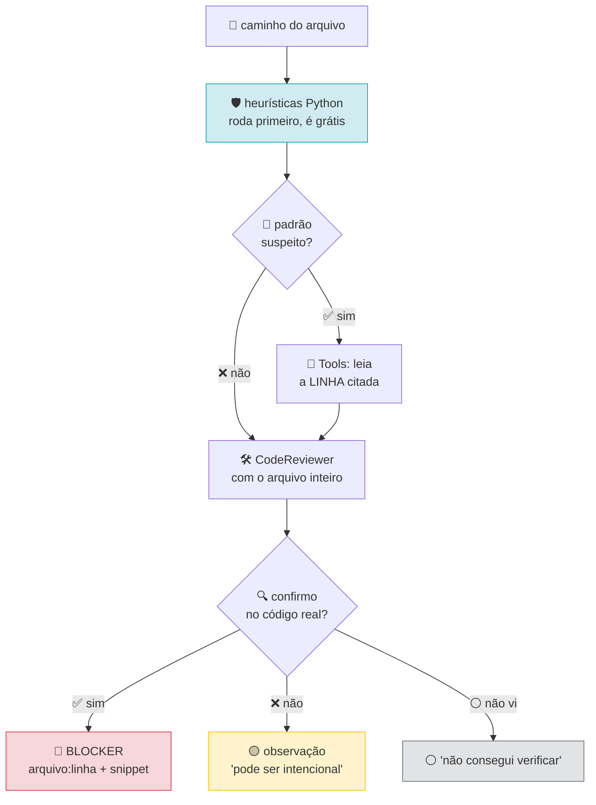

# 🔍 Code Reviewer

> Revisa um arquivo real e aponta problema concreto com linha e arquivo.
> *Reviews a real file and points at concrete problems with file and line.*

[](https://google.github.io/adk-docs/)
[]()

---

## 🇧🇷 Português

### 🎯 O que ele resolve

Revisão de código que não lê o código. Um LLM reviewing um trecho colado no
prompt especula sobre o que o resto do arquivo faz — e erra bonito, com
citação de linha.

Este agente **lê o arquivo do disco** antes de opinar. Toda afirmação vem com
`arquivo:linha`, e o que ele não viu ele diz que não viu.

### 🛡️ Os quatro padrões que ele caça

| Padrão | Gravidade | Por que importa |
|---|---|---|
| 🔑 `API_KEY` hardcoded | crítica | vaza no git, e o git não esquece |
| ⚠️ `except:` sem `log` | alta | engole o erro e o operador nunca sabe |
| 🌍 SQL com f-string | crítica | injeção, mesmo em "consulta interna" |
| 🔄 retry sem backoff | média | thundering herd no primeiro pico de erro |

### 🔁 O fluxo



A ordem importa: **heurística barata antes do modelo caro.** Os padrões do
`tools.py` rodam em Python puro, sem gastar request, e entregam ao modelo a
linha exata para ele confirmar. Confirmar é trabalho de LLM; varrer regex não é.

### 🔌 Como usar

```bash
adk run codereview ./common.py
```

```python
from codereview.agent import root_agent, analisar_arquivo

analisar_arquivo("./common.py")
# {'achados': [{'linha': 42, 'padrao': 'api_key_hardcoded', 'gravidade': 'critica'}]}
```

### 📋 Requisitos

| Item | Versão | Obrigatório |
|---|---|---|
| Python | ≥ 3.10 | ✅ |
| `google-adk` | 2.9.2 | ✅ |
| `GOOGLE_API_KEY` | — | ✅ |

### 💰 Custo

2 a 6 chamadas: uma por turno, o modelo pode pedir mais linhas para confirmar.

### 🧪 Testes

```bash
python3 tests/test_novos_agentes.py
```

Cobre os quatro padrões em cima, o path traversal (a tool recusa ler
`../../etc/passwd`), e o arquivo inexistente.

---

## 🇬🇧 English

### 🎯 What it solves

Code review that doesn't read the code. An LLM reviewing a snippet pasted into
the prompt guesses at what the rest of the file does — and it guesses well, with
line citations.

This agent **reads the file from disk** before opining. Every claim carries
`file:line`, and what it didn't see, it says it didn't see.

### 🛡️ The four patterns it hunts

| Pattern | Severity | Why it matters |
|---|---|---|
| 🔑 hardcoded `API_KEY` | critical | leaks into git, and git doesn't forget |
| ⚠️ `except:` without `log` | high | swallows the error, the operator never knows |
| 🌍 SQL with f-string | critical | injection, even in an "internal" query |
| 🔄 retry without backoff | medium | thundering herd on the first error spike |

### 🔁 The flow

See the Mermaid diagram above. The ordering matters: **cheap heuristics before
the expensive model.** The patterns in `tools.py` run in pure Python, cost no
requests, and hand the model the exact line to confirm. Confirming is LLM work;
regex scanning isn't.

### 🔌 How to use

```bash
adk run codereview ./common.py
```

```python
from codereview.agent import root_agent, analisar_arquivo
```

### 📋 Requirements

| Item | Version | Required |
|---|---|---|
| Python | ≥ 3.10 | ✅ |
| `google-adk` | 2.9.2 | ✅ |
| `GOOGLE_API_KEY` | — | ✅ |

### 💰 Cost

2 to 6 calls: one per turn, the model may request more lines to confirm.

### 🧪 Tests

```bash
python3 tests/test_novos_agentes.py
```

Covers the four patterns above, path traversal (the tool refuses to read
`../../etc/passwd`), and the missing-file case.

---

## 🔗 See also

| Agent | What it covers |
|---|---|
| [`rag/`](../rag/) | the other half — it reads and indexes the same files |
| [`linkcheck/`](../linkcheck/) | same philosophy: evidence before approval |
| [`triage/`](../triage/) | the one decision where calibrated confidence matters |
