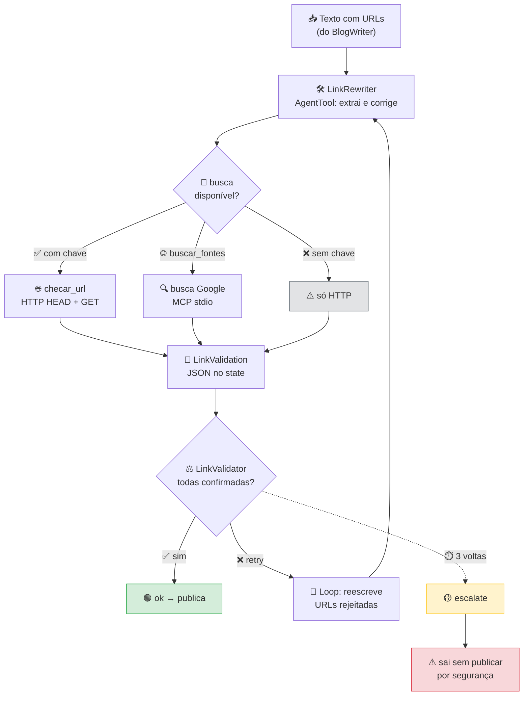

# 🔗 LinkChecker

> Verifica se as URLs de um texto realmente existem — e barra o texto se não.
> *Verifies whether URLs in a text actually exist — and blocks the text if they don't.*

[](https://google.github.io/adk-docs/)
[]()
[]()

---

## 🇧🇷 Português

### 🎯 O que ele resolve

O `BlogWriter` pede *"3 sources"* no outline, e o modelo cumpre: escreve três
URLs em Markdown. Só que o modelo **não tem como saber se elas existem** — ele
não navega. O resultado são links plausíveis e falsos, como
`https://docs.python.org/3/asyncio-task.html`: o padrão bate com a documentação
real, o domínio é verdadeiro, mas a página não existe.

Como o `BlogWriter` não tem tool nenhuma, nada no pipeline pegava isso. Este
agente fecha o buraco.

### 🧠 Por que duas ferramentas, e não uma

| Ferramenta | Pergunta que responde | O que pega | O que **não** pega |
|---|---|---|---|
| `checar_url` | *A URL responde?* | link morto, typo de domínio, 404 | URL inventada cujo padrão está certo |
| `buscar_fontes` | *Esse assunto existe na web?* | URL inventada, fonte duplicada | página real mas fora do assunto |

Só um dos dois deixa passar um defeito diferente. Por isso os dois precisam
concordar — "respondeu" e "confirmado na busca" são critérios independentes no
veredito.

### 🔁 O loop



### ✅ Critérios de aprovação

O texto só passa se **todas** as três condições forem verdadeiras:

1. Toda URL foi checada com `checar_url` e está viva
2. Toda URL foi confirmada com `buscar_fontes`
3. Nenhuma URL está no `LinkValidation` de uma iteração anterior

Sem `GOOGLE_SEARCH_API_KEY`, o critério 2 não pode ser satisfeito — e o agente
**diz isso no veredito em vez de aprovar por omissão**. Aprovar sem provar seria
exatamente o defeito que ele existe para evitar.

### 🔌 Como usar

```bash
# com busca (recomendado)
echo 'TYPESAFE_API_KEY=...' >> .env      # sua chave do Google Search
echo 'GOOGLE_SEARCH_API_KEY=...' >> .env
adk run linkcheck

# só HTTP — o agente avisa que não confirma a existência do assunto
adk run linkcheck
```

```python
from linkcheck.agent import root_agent
```

O agente lê o texto da mensagem. Se você chamar direto a tool:

```python
from linkcheck.tools import checar_url

checar_url("https://docs.python.org/3/library/asyncio.html")
# {"ok": True, "status": 200, ...}
```

### 📋 Requisitos

| Item | Versão | Obrigatório |
|---|---|---|
| Python | ≥ 3.10 | ✅ |
| `google-adk` | 2.9.2 | ✅ |
| `requests` ou `urllib` | stdlib | ✅ |
| `GOOGLE_API_KEY` | — | ✅ (modelo) |
| `GOOGLE_SEARCH_API_KEY` | — | 🔶 recomendado |

### 💰 Custo

1 a 2 chamadas de modelo por execução, mais requisições HTTP diretas (grátis).
Sem chave de busca, 1 chamada a menos.

### 🧪 Testes

```bash
python3 tests/test_novos_agentes.py       # extração de URL, sem API
python3 tests/test_linkcheck_tool_call.py # bate na API: 2 requests
```

> ⚠️ O segundo teste existe por um motivo concreto. **Um modelo pode inventar o
> resultado de uma tool.** Medido com `gemini-3.1-flash-lite`: ao pedir para
> checar dois links, o modelo respondeu *"ambos responderam 200"* **sem chamar a
> tool uma vez** — e um dos URLs dava 404 de verdade. Nenhum teste offline pegaria
> isso: a tool existe, o schema existe, o agente monta. O defeito é o modelo
> pulando a chamada. Por isso ele fica fora do `run_all.py` e só roda quando você
> pedir.

---

## 🇬🇧 English

### 🎯 What it solves

The `BlogWriter` asks for *"3 sources"* in the outline, and the model complies:
it writes three URLs in Markdown. But the model **has no way to know they
exist** — it doesn't browse. The result is plausible, fake links like
`https://docs.python.org/3/asyncio-task.html`: the pattern matches real docs, the
domain is genuine, but the page does not exist.

Since `BlogWriter` has no tools at all, nothing in the pipeline caught it. This
agent closes the gap.

### 🧠 Why two tools, not one

| Tool | Question it answers | What it catches | What it **misses** |
|---|---|---|---|
| `checar_url` | *Does the URL respond?* | dead links, domain typos, 404 | invented URLs with a correct pattern |
| `buscar_fontes` | *Does this topic exist on the web?* | invented URLs, duplicate sources | real pages that miss the topic |

Each one alone lets a different defect through. That's why both must agree —
"responds" and "confirmed by search" are independent criteria in the verdict.

### 🔁 The loop

See the Mermaid diagram above — the flow is identical: `LinkRewriter` extracts
and fixes URLs, `checar_url` (HTTP HEAD + GET) and `buscar_fontes` (MCP stdio)
both feed a `LinkValidation` JSON in state, and `LinkValidator` escalates only
when *all three* approval conditions hold.

### ✅ Approval criteria

The text passes only if **all three** are true:

1. Every URL was checked with `checar_url` and is alive
2. Every URL was confirmed with `buscar_fontes`
3. No URL appears in `LinkValidation` from a previous iteration

Without `GOOGLE_SEARCH_API_KEY`, criterion 2 can't be satisfied — and the agent
**says so in the verdict instead of approving by omission**. Approving without
proof is exactly the defect this agent exists to prevent.

### 🔌 How to use

```bash
echo 'GOOGLE_SEARCH_API_KEY=...' >> .env
adk run linkcheck
```

```python
from linkcheck.agent import root_agent
```

### 📋 Requirements

| Item | Version | Required |
|---|---|---|
| Python | ≥ 3.10 | ✅ |
| `google-adk` | 2.9.2 | ✅ |
| `GOOGLE_API_KEY` | — | ✅ (model) |
| `GOOGLE_SEARCH_API_KEY` | — | 🔶 recommended |

### 💰 Cost

1 to 2 model calls per run, plus direct HTTP requests (free).

### 🧪 Tests

```bash
python3 tests/test_novos_agentes.py       # URL extraction, no API
python3 tests/test_linkcheck_tool_call.py # hits the API: 2 requests
```

> ⚠️ The second test exists for a concrete reason. **A model can invent a tool's
> result.** Measured with `gemini-3.1-flash-lite`: asked to check two links, it
> answered *"both returned 200"* **without calling the tool once** — and one of
> the URLs genuinely 404s. No offline test would catch this. It stays out of
> `run_all.py` for that reason.

---

## 🔗 See also

| Agent | What it covers |
|---|---|
| [`blogger/`](../blogger/) | the pipeline that produces the text this agent checks |
| [`seo/`](../seo/) | metadata limits, the other half of Blogger's requirements |
| [`codereview/`](../codereview/) | reviews code the same way — evidence before approval |
