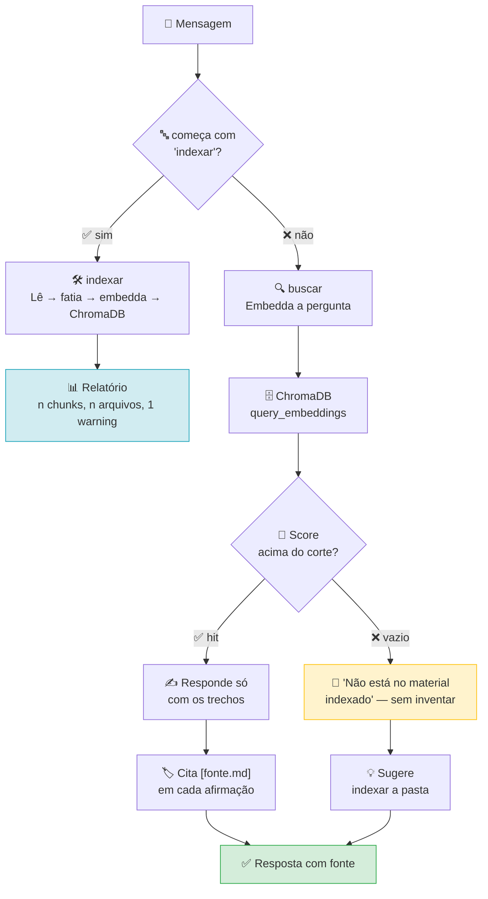
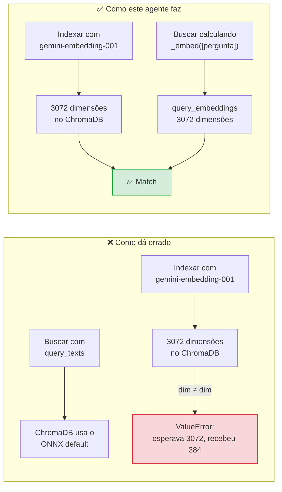

# 🧠 RAG Agent

> Responde perguntas sobre documentos indexados no disco, citando a fonte.
> *Answers questions from documents indexed on disk, citing the source.*

[](https://google.github.io/adk-docs/)
[]()
[]()

---

## 🇧🇷 Português

### 🎯 O que ele resolve

Um LLM não conhece seus documentos. A resposta "no seu arquivo `config.py` a
variável é `TIMEOUT`" pode ser inventada com a confiança de quem leu o arquivo.

Este agente indexa documentos reais em ChromaDB e **obrigatoriamente cita a
fonte**. Se não está no material indexado, ele diz que não está — em vez de
preencher a lacuna do próprio conhecimento.

### 📦 O que ele indexa

| Tipo | Extensão | Observação |
|---|---|---|
| Markdown | `.md` | fatiado por seção (`#`), cada `##` vira um chunk |
| Texto | `.txt` | fatiado por tamanho fixo |
| Python | `.py` | por função e classe (`def` / `class`) |
| Config | `.json`, `.yaml` | arquivo inteiro, normalmente < 2000 chars |

A pasta `.indice/` é ignorada na indexação — sem isso, o agente indexaria o
próprio índice.

### 🔁 O fluxo



### ⚠️ O bug mais importante deste agente

O caso mais silencioso de RAG quebrado: **indexar com um modelo e buscar com
outro**.



`query_texts=` faz o ChromaDB baixar o ONNX default dele (79 MB) e comparar 384
dimensões contra as 3072 que foram gravadas. Aqui os dois lados usam o **mesmo**
embedder: `_embed([pergunta])[0]` + `query_embeddings=`. Sem o ONNX, sem
download, sem `ValueError`.

### 🔌 Como usar

```bash
# indexar
adk run rag "indexar ./docs"

# perguntar
adk run rag "o que a variavel TIMEOUT controla?"
```

```python
from rag.agent import root_agent, indexar, buscar

indexar("./docs")   # {'arquivos': 12, 'chunks': 87, 'warnings': 0}
buscar("timeout")   # lista de dicts com 'texto' e 'fonte'
```

### 📋 Requisitos

| Item | Versão | Obrigatório |
|---|---|---|
| Python | ≥ 3.10 | ✅ |
| `google-adk` | 2.9.2 | ✅ |
| `chromadb` | 1.5.9 | ✅ |
| `google-genai` | — | ✅ (embeddings) |
| `GOOGLE_API_KEY` | — | ✅ |

> ⚠️ `chromadb` deve ser declarado no `requirements.txt`. Instalado à mão, ele
> sobe `opentelemetry-api` para 1.45 e quebra o `google-adk 2.9.2`, que exige
> `<=1.42.1`.

### 💰 Custo

Embeddings têm **cota separada** do modelo de texto. Indexar 87 chunks consome
uma chamada de embedding por chunk, em lote de 20.

> 🚧 **Estado atual:** o plumbing está testado (18/18) com um embedder falso, mas
> a indexação real **não foi concluída** — a cota de embeddings já estava
> esgotada. Rode quando resetar para validar a chamada real.

### 🧪 Testes

```bash
python3 tests/test_rag.py
```

Testa chunkagem, coleção, reindexação sem duplicar e ordenação por
similaridade — **sem API**, com embedder determinístico de 256 dimensões.

---

## 🇬🇧 English

### 🎯 What it solves

An LLM doesn't know your documents. The answer *"in your `config.py` the
variable is `TIMEOUT`"* can be invented with the confidence of someone who
actually read the file.

This agent indexes real documents into ChromaDB and **always cites the source**.
If it's not in the indexed material, it says so — instead of filling the gap
from its own knowledge.

### 📦 What it indexes

| Type | Extension | Notes |
|---|---|---|
| Markdown | `.md` | split by section (`#`), each `##` becomes a chunk |
| Text | `.txt` | fixed-size chunks |
| Python | `.py` | by function and class (`def` / `class`) |
| Config | `.json`, `.yaml` | whole file, usually < 2000 chars |

The `.indice/` folder is skipped — otherwise the agent would index its own index.

### 🔁 The flow

See the Mermaid diagram above: `indexar` reads, chunks, embeds and stores;
`buscar` embeds the *question* with the same model and queries with
`query_embeddings`.

### ⚠️ The most important bug in this agent

The quietest way to break RAG: **index with one model, search with another.**

`query_texts=` makes ChromaDB download its default ONNX model (79 MB) and compare
384 dimensions against the 3072 that were written. Here both sides use the
**same** embedder: `_embed([pergunta])[0]` + `query_embeddings=`. No ONNX, no
download, no `ValueError`.

### 🔌 How to use

```bash
adk run rag "index ./docs"
adk run rag "what does the TIMEOUT variable control?"
```

```python
from rag.agent import root_agent, indexar, buscar
```

### 📋 Requirements

| Item | Version | Required |
|---|---|---|
| Python | ≥ 3.10 | ✅ |
| `google-adk` | 2.9.2 | ✅ |
| `chromadb` | 1.5.9 | ✅ |
| `google-genai` | — | ✅ (embeddings) |
| `GOOGLE_API_KEY` | — | ✅ |

> ⚠️ `chromadb` must be declared in `requirements.txt`. Installed by hand it
> upgrades `opentelemetry-api` to 1.45 and breaks `google-adk 2.9.2`, which
> requires `<=1.42.1`.

### 💰 Cost

Embeddings have a **separate quota** from the text model. Indexing 87 chunks
costs one embedding call per chunk, batched 20 at a time.

> 🚧 **Current state:** the plumbing is tested (18/18) with a fake embedder, but
> the real index has **not** completed — the embedding quota was already
> exhausted. Re-run it once the quota resets to validate the real call.

### 🧪 Tests

```bash
python3 tests/test_rag.py
```

Tests chunking, collection, reindexing without duplicates and similarity
ordering — **without API**, using a deterministic 256-dimension embedder.

---

## 🔗 See also

| Agent | What it covers |
|---|---|
| [`researcher/`](../researcher/) | the same question asked about the *web* instead of local files |
| [`codereview/`](../codereview/) | reads real files, the other half of this agent |
| [`linkcheck/`](../linkcheck/) | proves a URL is real before citing it |
