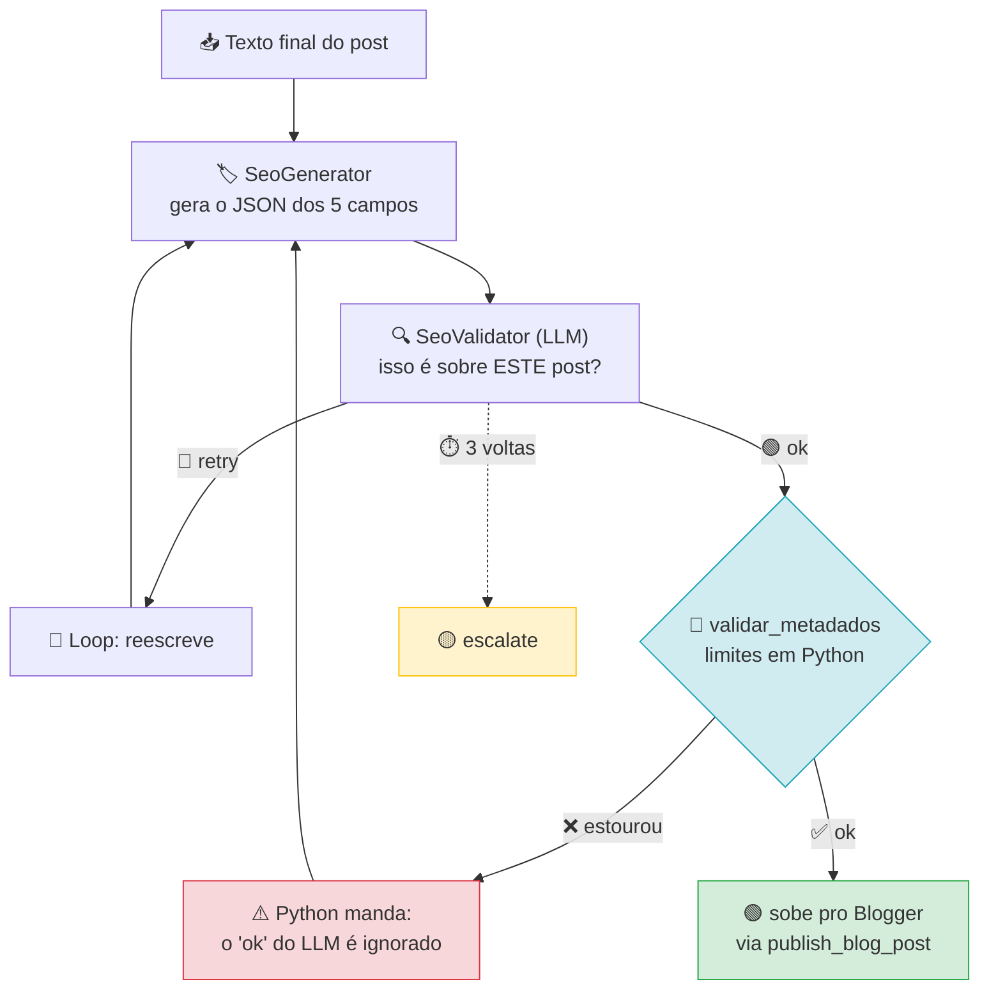

# 🏷️ SEO Agent

> Gera e valida os metadados que o Blogger exige — e recusa o post se estourar o limite.
> *Generates and validates the metadata Blogger requires — and refuses the post if it exceeds a limit.*

[](https://google.github.io/adk-docs/)
[]()

---

## 🇧🇷 Português

### 🎯 O que ele resolve

O Blogger não aceita metadata fora dos limites. Título acima de 100 caracteres
ou `description` acima de 200 é rejeitado na hora do publish — e o erro vem de
um endpoint, três passos depois de todo o trabalho de texto já feito.

Este agente gera os cinco campos **e** aplica a régua antes de liberar o post.

### 📐 Limites que ele impõe

| Campo | Limite | Regra |
|---|---|---|
| `titulo` | ≤ 100 caracteres | obrigatório, não vazio |
| `meta_description` | ≤ 155 caracteres | obrigatória, não vazia |
| `slug` | ≤ 50 caracteres | só ASCII `a-z` `0-9` e `-`; sem acento, sem espaço, sem `_`, sem `--`, não começa nem termina com `-` |
| `tags` | lista, 1 a 5 itens | sem repetidas; `blog`, `post`, `artigo`, `postagem`, `texto` e `tutorial` são rejeitadas |
| `alt_text` | obrigatório | não vazio |

> A tabela acima é a que o código impõe, não a que o modelo foi pedido a
> seguir. O `slug` exige ASCII: em Python `c.isalnum()` devolve `True` para `ã`
> e `ç`, então a validação também checa `isascii()` — sem isso um slug acentuado
> passava pelo portão e quebrava a URL no Blogger.

### 🔁 O loop



**Ordem real:** o LLM valida primeiro (julgamento semântico) e o Python decide
no fim (limites duros). Se o LLM disser `ok` e o Python reprovar, **o Python
vence** — o `ok` é sobrescrito por `retry: <erros>` e volta ao gerador. Contar
100 caracteres é aritmética; um LLM contando caracteres erra, e é por isso que
o portão final é código e não prompt.

A distinção importante: **`validar_metadados` roda em Python, não no modelo.**
Os limites são aritmética — contar caracteres não precisa de um LLM, e um LLM
contando caracteres erra. O `SeoValidator` (que é o modelo) existe só para
julgar se a keyword aparece de forma natural, que é o que código não decide.

### 🔌 Como usar

```bash
adk run seo "Python async: 7 erros comuns"
```

```python
from seo.agent import root_agent, validar_metadados

validar_metadados({
    "titulo": "Python async: 7 erros comuns",       # max 100
    "meta_description": "Os erros que mais travam async.",  # max 155
    "slug": "python-async-7-erros-comuns",         # ASCII, max 50
    "tags": ["python", "async"],                   # max 5, sem tag genérica
    "alt_text": "Diagrama de um event loop",
})
# []  -> lista de erros, vazia = publicável
```

### 📋 Requisitos

| Item | Versão | Obrigatório |
|---|---|---|
| Python | ≥ 3.10 | ✅ |
| `google-adk` | 2.9.2 | ✅ |
| `GOOGLE_API_KEY` | — | ✅ |

### 💰 Custo

1 a 2 chamadas. 1 se o validador aprovar de primeira.

### 🧪 Testes

```bash
python3 tests/test_novos_agentes.py
```

Cobre os 11 casos de borda que o Blogger realmente rejeita: acento, emoji,
`slug` com underscore, 6 tags, `alt` longo, campo faltando.

---

## 🇬🇧 English

### 🎯 What it solves

Blogger won't accept metadata outside its limits. A title over 100 characters
or a `description` over 200 is rejected at publish time — and the error surfaces
from an endpoint, three steps after all the text work is done.

This agent generates the five fields **and** applies the ruler before letting
the post through.

### 📐 Limits it enforces

| Field | Limit | Rule |
|---|---|---|
| `titulo` | ≤ 100 chars | required, not empty |
| `meta_description` | ≤ 155 chars | required, not empty |
| `slug` | ≤ 50 chars | ASCII `a-z` `0-9` `-` only; no accents, spaces, `_`, `--`, or leading/trailing `-` |
| `tags` | list, 1–5 items | no duplicates; `blog`, `post`, `artigo`, `postagem`, `texto`, `tutorial` are rejected |
| `alt_text` | required | not empty |

The keys are `titulo` / `meta_description` / `slug` / `tags` / `alt_text` — not
the `title` / `description` / `alt` names the Blogger API also accepts. The code
validates the first set.

### 🔁 The loop

See the Mermaid diagram above. The important distinction: **`validar_metadados`
runs in Python, not in the model.** Limits are arithmetic — counting characters
doesn't need an LLM, and an LLM counting characters gets it wrong. `SeoValidator`
(the model) runs first and only answers a question code cannot: *is this about
the right post?* Python has the last word. If the LLM says `ok` and Python
rejects the metadata, the `ok` is overwritten with `retry: <errors>` and the
generator gets another turn.

### 🔌 How to use

```bash
adk run seo "Python async: 7 common mistakes"
```

```python
from seo.agent import root_agent, validar_metadados

validar_metadados({
    "titulo": "Python async: 7 common mistakes",       # max 100
    "meta_description": "The mistakes that stall async.",  # max 155
    "slug": "python-async-7-common-mistakes",          # ASCII, max 50
    "tags": ["python", "async"],                      # max 5, no generic tags
    "alt_text": "Diagram of an event loop",
})
# []  -> a list of errors; empty means publishable
```

### 📋 Requirements

| Item | Version | Required |
|---|---|---|
| Python | ≥ 3.10 | ✅ |
| `google-adk` | 2.9.2 | ✅ |
| `GOOGLE_API_KEY` | — | ✅ |

### 💰 Cost

1 to 2 calls. 1 if the validator approves on the first pass.

### 🧪 Tests

```bash
python3 tests/test_novos_agentes.py
```

Covers the 11 edge cases Blogger actually rejects: accents, emoji, `slug` with an
underscore, 6 tags, long `alt`, missing field.

---

## 🔗 See also

| Agent | What it covers |
|---|---|
| [`blogger/`](../blogger/) | the pipeline this agent is part of |
| [`linkcheck/`](../linkcheck/) | the *content* side of the same post |
| [`codereview/`](../codereview/) | a third "validate before approving" pattern |
