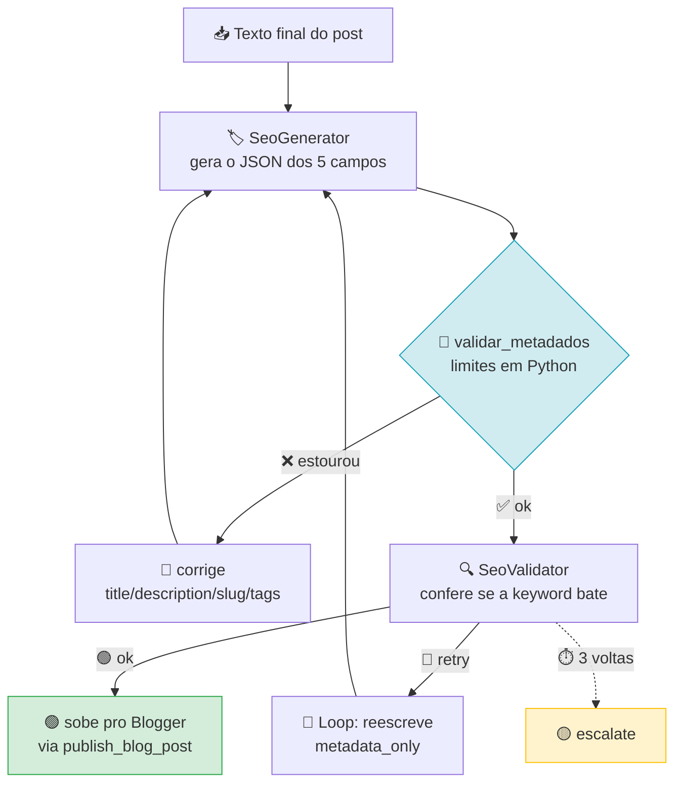

# 🏷️ SEO Agent

> Gera e valida os metadados que o Blogger exige — e recusa o post se estourar o limite.
> *Generates and validates the metadata Blogger requires — and refuses the post if it exceeds a limit.*

[](https://google.github.io/adk-docs/)
[]()

---

## 🇧🇷 Português

### 🎯 O que ele resolve

O Blogger não aceita metadata fora dos limites. Título acima de 100 caracteres
ou `description` acima de 200 é rejeitado na hora do publish — e o erro vem de
um endpoint, três passos depois de todo o trabalho de texto já feito.

Este agente gera os cinco campos **e** aplica a régua antes de liberar o post.

### 📐 Limites que ele impõe

| Campo | Limite | Regra |
|---|---|---|
| `title` | ≤ 100 | precisa conter a keyword principal |
| `description` | ≤ 200 | precisa conter a keyword principal |
| `slug` | ≤ 50 | apenas `a-z`, `0-9` e `-` |
| `tags` | ≤ 60, até 5 tags | `,` separa, sem espaços nas tags |
| `alt` | ≤ 125 | uma descrição por imagem |

### 🔁 O loop



A distinção importante: **`validar_metadados` roda em Python, não no modelo.**
Os limites são aritmética — contar caracteres não precisa de um LLM, e um LLM
contando caracteres erra. O `SeoValidator` (que é o modelo) existe só para
julgar se a keyword aparece de forma natural, que é o que código não decide.

### 🔌 Como usar

```bash
adk run seo "Python async: 7 erros comuns"
```

```python
from seo.agent import root_agent, validar_metadados

validar_metadados({"title": "Python async", "description": "Guia"})
# {"ok": True, "erros": []}
```

### 📋 Requisitos

| Item | Versão | Obrigatório |
|---|---|---|
| Python | ≥ 3.10 | ✅ |
| `google-adk` | 2.9.2 | ✅ |
| `GOOGLE_API_KEY` | — | ✅ |

### 💰 Custo

1 a 2 chamadas. 1 se o validador aprovar de primeira.

### 🧪 Testes

```bash
python3 tests/test_novos_agentes.py
```

Cobre os 11 casos de borda que o Blogger realmente rejeita: acento, emoji,
`slug` com underscore, 6 tags, `alt` longo, campo faltando.

---

## 🇬🇧 English

### 🎯 What it solves

Blogger won't accept metadata outside its limits. A title over 100 characters
or a `description` over 200 is rejected at publish time — and the error surfaces
from an endpoint, three steps after all the text work is done.

This agent generates the five fields **and** applies the ruler before letting
the post through.

### 📐 Limits it enforces

| Field | Limit | Rule |
|---|---|---|
| `title` | ≤ 100 | must contain the main keyword |
| `description` | ≤ 200 | must contain the main keyword |
| `slug` | ≤ 50 | only `a-z`, `0-9` and `-` |
| `tags` | ≤ 60, up to 5 tags | `,` separated, no spaces inside a tag |
| `alt` | ≤ 125 | per image |

### 🔁 The loop

See the Mermaid diagram above. The important distinction: **`validar_metadados`
runs in Python, not in the model.** Limits are arithmetic — counting characters
doesn't need an LLM, and an LLM counting characters gets it wrong. `SeoValidator`
(the model) exists only to judge whether the keyword shows up naturally, which
code cannot decide.

### 🔌 How to use

```bash
adk run seo "Python async: 7 common mistakes"
```

```python
from seo.agent import root_agent, validar_metadados
```

### 📋 Requirements

| Item | Version | Required |
|---|---|---|
| Python | ≥ 3.10 | ✅ |
| `google-adk` | 2.9.2 | ✅ |
| `GOOGLE_API_KEY` | — | ✅ |

### 💰 Cost

1 to 2 calls. 1 if the validator approves on the first pass.

### 🧪 Tests

```bash
python3 tests/test_novos_agentes.py
```

Covers the 11 edge cases Blogger actually rejects: accents, emoji, `slug` with an
underscore, 6 tags, long `alt`, missing field.

---

## 🔗 See also

| Agent | What it covers |
|---|---|
| [`blogger/`](../blogger/) | the pipeline this agent is part of |
| [`linkcheck/`](../linkcheck/) | the *content* side of the same post |
| [`codereview/`](../codereview/) | a third "validate before approving" pattern |
