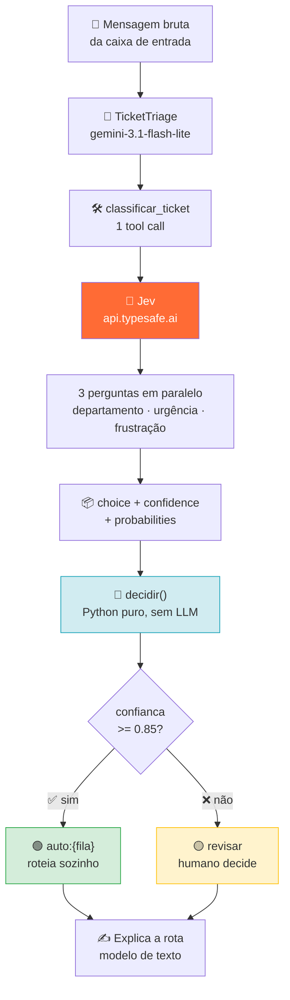
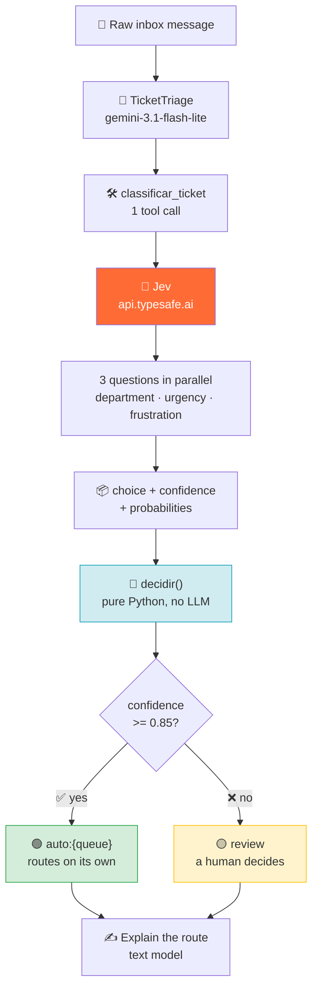

# 🎫 Ticket Triage

> Lê uma mensagem de suporte e decide a fila — por confiança calibrada, não por palpite.
> *Reads a support message and picks the queue — by calibrated confidence, not by guess.*

[](https://google.github.io/adk-docs/)
[](https://typesafe.ai/)
[]()

---

## 🇧🇷 Português

### 🎯 O que ele resolve

Uma caixa de suporte recebe tudo junto: *"minha fatura veio errada"*, *"a API
está dando 500"*, *"quanto custa o plano enterprise?"*. Triagem é decidir a
fila — e é a **primeira** decisão de um agente, a mais barata e a que menos se
quer errar. Classificar "quero um reembolso" como `sales` custa o cliente
esperando até sexta.

### 🔬 A pergunta: o ADK suporta o Jev?

**Sim, com uma forma específica.** E essa forma não é a óbvia.

O ADK tem `BaseLlm` como contrato de um **gerador de texto**. O
[Jev](https://typesafe.ai/) é o oposto deliberado: não gera texto, devolve
decisão tipada com probabilidade e confiança. Colocá-lo em `Agent(model=jev)`
seria um **erro de contrato** — todo o resto do projeto (os loops `ok`/`retry`,
os validadores, o Writer) lê texto.

Então o Jev entra como **tool**, não como modelo:



### 🎯 A divisão do trabalho

O que faz melhor cada um dos dois — e por que forçar um a fazer o trabalho do
outro piora os dois:

| Tarefa | Quem faz melhor | Por quê |
|---|---|---|
| **Classificar** | 🧠 Jev | devolve a probabilidade. Um LLM de texto não tem como dizer o quanto tem certeza |
| **Apresentar** | ✍️ Gemini | explicar ao usuário *por que* foi para billing é linguagem natural |

Um LLM de texto classificando "quero um reembolso" e "quero um reembolso agora"
pode devolver `sales` e `billing` com o **mesmo tom**. Não existe como auditar
isso. O Jev devolve `{"choice": "billing", "confidence": 0.93}` — verificável,
comparável, e vira regra.

### 🧮 Por que a regra está em código, não no prompt

`jev.decidir()` é uma **função pura** em Python. Três motivos:

| | Se estivesse no prompt | Em código |
|---|---|---|
| 🎫 **Auditoria** | "por que foi pra billing?" → novo palpite do mesmo modelo | o `motivo` traz o número exato |
| 💰 **Custo** | mudar a política = mexer em comportamento, com custo por request | editar um número |
| 🧪 **Teste** | só testável com API | roda offline, 100% coberto |

O limiar é um **argumento**, não constante:

```python
jev.decidir(answers, limiar=0.85)   # time mais conservador
jev.decidir(answers, limiar=0.95)   # quase tudo vai pra revisão
```

### 🔌 Como usar

```bash
# 1.Pegue a chave em https://console.typesafe.ai/keys
# 1. Escolha UM dos dois caminhos:
#      OpenRouter -> https://openrouter.ai/keys  (sem waitlist)
#      TypeSafe   -> https://console.typesafe.ai/keys
echo 'OPENROUTER_API_KEY=...' >> .env

# 2. Rode
adk run triage "não recebi o reembolso que pedi dia 10"
```

Saída esperada:

```text
**Route:** auto:billing
**Department:** billing
**Confidence:** 0.93
**Urgency:** no
**Frustration:** frustrated but civil
**Why:** confidence 0.93 >= 0.85
```

### 🔌 Como usar em código

```python
from triage.agent import root_agent, classificar_ticket

r = classificar_ticket("a API está retornando 500 desde ontem")
# {
#   'rota': 'auto:technical',
#   'departamento': 'technical',
#   'confianca': 0.88,
#   'probabilidades': {'technical': 0.88, 'billing': 0.09, 'sales': 0.03},
#   'segunda_opcao': 'billing',
#   'urgente': True,
#   'frustracao': 1.0,
#   'motivo': 'confianca 0.88 >= 0.85',
#   'modo': 'jev',
# }
```

### 📋 Requisitos

| Item | Versão | Obrigatório |
|---|---|---|
| Python | ≥ 3.10 | ✅ |
| `google-adk` | 2.9.2 | ✅ |
| `OPENROUTER_API_KEY` **ou** `TYPESAFE_API_KEY` | — | 🔶 recomendado |
| `GOOGLE_API_KEY` | — | ✅ (modelo que apresenta) |

> 💡 **O SDK oficial (`typesafe-sdk`) não é necessário.** O cliente em
> `triage/jev.py` faz um POST com `urllib` da stdlib — zero dependência nova, e
> o mesmo estilo de `linkcheck/tools.py`. Instale o SDK se preferir.

### 🔀 Dois caminhos para o mesmo modelo

O Jev é um *System One* da TypeSafe, e existem dois jeitos de chegar nele. O
código do `triage` não sabe a diferença: a API do OpenRouter replica o payload
e o formato de resposta do System One, e mapeia o ID cru do modelo no namespace
deles (`jev-latest` → `~typesafe/jev-latest`).

| | OpenRouter | TypeSafe direto |
|---|---|---|
| Onde pega a chave | `openrouter.ai/keys` | `console.typesafe.ai/keys` |
| Waitlist | **não** | houve |
| Conta extra | nenhuma | conta TypeSafe |
| Preço | $0,042/1M tokens de entrada, saída grátis | idem |
| Salto extra | 1 (o gateway) | 0 |
| `usage.cost` em USD | sim | não |

> ⚠️ **O Jev não é um modelo `:free`.** A cota gratuita de conta nova do
> OpenRouter cobre apenas os modelos marcados com `:free`; para o Jev a API
> responde `402 Insufficient credits` até haver saldo. Não é bug do repo — é
> faturamento do gateway. O custo real é irrisório: um triage de ticket com
> três perguntas gasta ~450 tokens de entrada, ou **~US$ 0,00002** por
> chamada. A compra mínima no OpenRouter é US$ 5, com taxa de 5,5%
> (mínimo US$ 0,80).

Com as duas chaves no `.env`, a **TypeSafe tem preferência** (vai direto ao
fornecedor). `JEV_PROVEDOR=openrouter` ou `=typesafe` inverte. `JEV_MODELO`
sobrescreve o modelo, que por padrão é `jev-latest`.

### 🎯 Adaptar ao seu negócio

As categorias estão em **um único lugar**, `triage/jev.py`:

```python
DEPARTAMENTOS = {
    "billing": "Payment, invoice, subscription, refund or charge problems",
    "technical": "Bugs, errors, API integration failures or outages",
    "sales": "Pricing questions, plan upgrades, quotes or procurement",
}
```

O `criteria` do `Choice` **é** a definição de cada categoria para o Jev. Troque
aqui e o roteamento inteiro muda junto.

### 💰 Custo

1 request do Gemini + 1 request do Jev. O Jev se apresenta como
≈444× mais barato que LLM de texto equivalente para tarefas de decisão
([fonte](https://typesafe.ai/)) — mas isso é claim do fornecedor, e a única
forma de saber no seu caso é medir.

### 🧪 Testes

```bash
python3 tests/test_triage.py
```

Cobre a regra de roteamento inteira **sem API**: limiar inclusivo, limiar como
argumento, segunda opção correta, respostas degeneradas, e o fallback sem chave.

> ⚠️ **O que os testes NÃO provam:** que a confiança do Jev é bem calibrada no
> *seu* dataset. Isso exige mensagens reais e rotuladas, e é a única coisa que
> valida o limiar 0.85. Mock não prova calibração.

---

## 🇬🇧 English

### 🎯 What it solves

A support inbox gets everything at once: *"my invoice was wrong"*, *"the API has
been returning 500 since yesterday"*, *"how much is the enterprise plan?"*.
Triage is picking the queue — the **first** decision an agent makes, the
cheapest, and the one you'd least like to get wrong. Routing "I want a refund" to
`sales` costs the customer a wait until Friday.

### 🔬 The question: does the ADK support Jev?

**Yes, in a specific way.** And it isn't the obvious one.

The ADK's `BaseLlm` is a contract for a **text generator**. [Jev](https://typesafe.ai/)
is the deliberate opposite: no text generation, just typed decisions with
probability and confidence. Putting it in `Agent(model=jev)` would be a
**contract error** — the rest of this project (the `ok`/`retry` loops, the
validators, the Writer) reads text.

So Jev enters as a **tool**, not as a model:



### 🎯 Division of labour

| Task | Better done by | Why |
|---|---|---|
| **Classify** | 🧠 Jev | returns probability. A text LLM can't say how sure it is |
| **Present** | ✍️ Gemini | explaining *why* it went to billing is natural language |

A text LLM classifying "I want a refund" and "I want a refund now" may return
`sales` and `billing` in the **same tone**. There's no way to audit that. Jev
returns `{"choice": "billing", "confidence": 0.93}` — verifiable, comparable, and
convertible into a rule.

### 🧮 Why the rule lives in code, not the prompt

`jev.decidir()` is a **pure function** in Python — see the table above for the
three reasons (auditability, cost, testability). The threshold is an argument:

```python
jev.decidir(answers, limiar=0.85)
jev.decidir(answers, limiar=0.95)
```

### 🔌 How to use

```bash
# 1. Pick ONE of the two paths:
#      OpenRouter -> https://openrouter.ai/keys  (no waitlist)
#      TypeSafe   -> https://console.typesafe.ai/keys
echo 'OPENROUTER_API_KEY=...' >> .env
adk run triage "I never got the refund I asked for on the 10th"
```

```python
from triage.agent import root_agent, classificar_ticket
```

### 📋 Requirements

| Item | Version | Required |
|---|---|---|
| Python | ≥ 3.10 | ✅ |
| `google-adk` | 2.9.2 | ✅ |
| `OPENROUTER_API_KEY` **or** `TYPESAFE_API_KEY` | — | 🔶 recommended |
| `GOOGLE_API_KEY` | — | ✅ (presenting model) |

> 💡 **The official SDK (`typesafe-sdk`) is not required.** The client in
> `triage/jev.py` does a POST with stdlib `urllib` — zero new dependencies, same
> style as `linkcheck/tools.py`.

### 🎯 Adapting to your business

The categories live in **one place**, `triage/jev.py`. The `Choice` `criteria`
**is** the definition of each category to Jev. Change it and the whole routing
changes with it.

### 💰 Cost

1 Gemini request + 1 Jev request. Jev presents itself as ≈444× cheaper than an
equivalent text LLM for decision tasks ([source](https://typesafe.ai/)) — but
that's a vendor claim, and measuring your own traffic is the only way to know.

### 🧪 Tests

```bash
python3 tests/test_triage.py
```

Covers the entire routing rule **without API**: inclusive threshold, threshold as
an argument, correct runner-up, degenerate answers, and the no-key fallback.

> ⚠️ **What the tests do NOT prove:** that Jev's confidence is well calibrated on
> *your* dataset. That needs real labelled messages, and it's the only thing that
> validates the 0.85 threshold. A mock can't prove calibration.

---

## 🔗 See also

| Agent | What it covers |
|---|---|
| [`linkcheck/`](../linkcheck/) | the other "prove it before approving" pattern |
| [`codereview/`](../codereview/) | evidence before approval, in code |
| [`rag/`](../rag/) | answers from real indexed documents |
